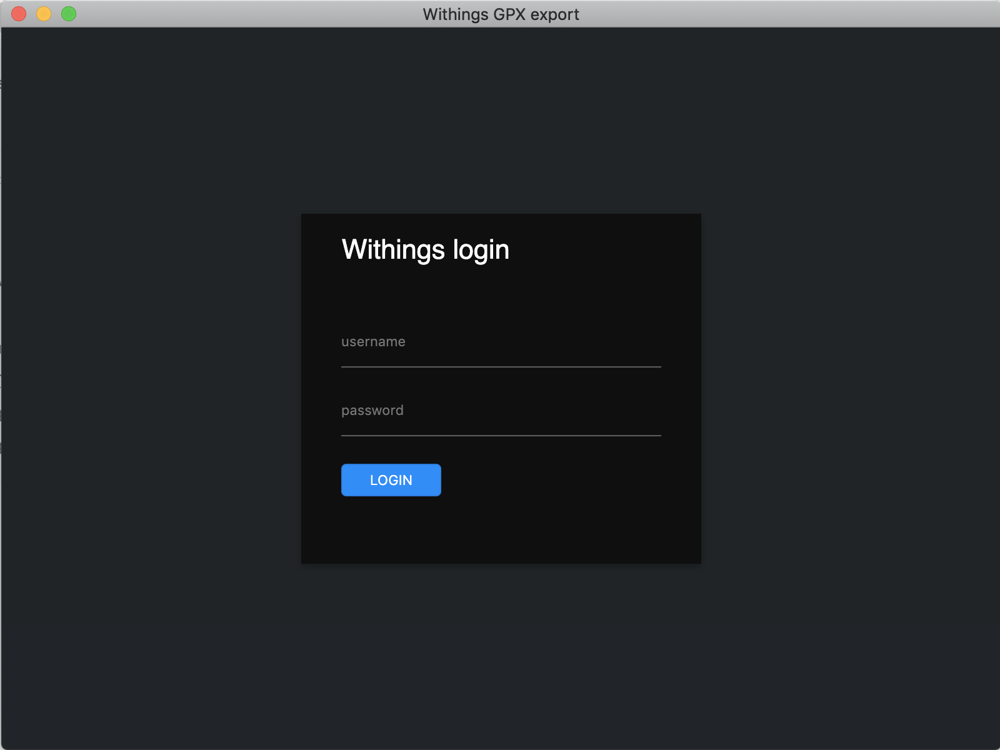
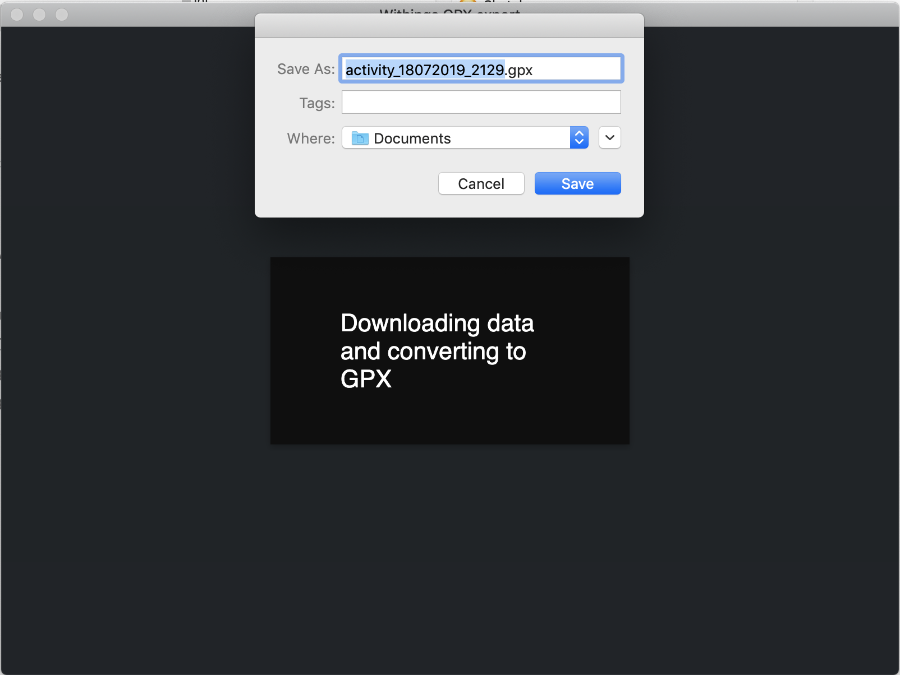

# Withings GPX export

This project is meant to export cycling or walking activities from Withings to GPX. The GPX file contains the location and heartrate data which can be imported into other platforms such as [Strava](https://www.strava.com/) The application does not store or send any data to any other platform.






## Download installers

[macOS v0.1.4 alpha](https://github.com/vertongen/withings-gpx/releases/download/v0.1.4-alpha/Withings.gpx.export-0.1.4.dmg) 

[Windows 64bit & 32bit v0.1.4 alpha](https://github.com/vertongen/withings-gpx/releases/download/v0.1.4-alpha/Withings.gpx.export.Setup.0.1.4.exe)

## To Use

To clone and run this repository you’ll need [Git](https://git-scm.com/), [Node.js](https://nodejs.org/en/download/) and [Yarn](https://yarnpkg.com/lang/en/) installed on your computer. From your command line:

```bash
# Clone this repository
git clone https://github.com/vertongen/withings-gpx.git
# Go into the repository
cd withings-gpx
# Install dependencies
yarn install
# Run the app
yarn start
```

## License

[CC0 1.0 (Public Domain)](license.md)
